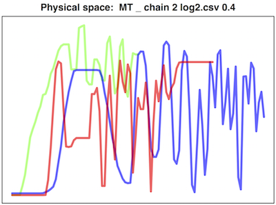

# Introduction

Winter (2014) suggests that non-linear spaces lead to *output stability* (similarity in acoustic signals), and *input variability* (variation in the motor input).

For our experiment, the prediction is that the variation in acoustic signals should be similar across curvature values, but the variation in motor signals should decrease as curvature increases.

The measure of variability used here is the following: Take two participants from different chains, but using the same curvature value and in the same generation number.  The distance between a signal produced by participant A and a signal produced by participant B is calculated using dynamic time warping (not normalised for length).  Each participant has 3 signals, but we can't be sure that the meaning mappings are being preserved throught the chain.  Therefore, we match signals to each other based on similarity (using a greedy algorithm: the two most similar signals go together, then the next two most similar).  

This leads to a set of distances between each participants in the same chain and generation.  So, if generations are laid out horizontally, this is like taking a vertical slice across chains.

The same process is applied to the acoustic output (the pitch produced, in Bark scale) and the motor input (where the participant's finger is).

We predict that the distance between motor signals will be predicted by:

-  generation (positive, chains diverge from each other)
-  curvature x generation (distance will increase faster over generations for higher curvatures)

# Libraries

```{r, warning=F, message=F}
library(blme)
library(party)
library(sjPlot)
library(gplots)
library(dplyr)
```

# Load data

```{r echo=F, eval=F}
setwd("/Library/WebServer/Documents/ILMTurk/stats/R")
```


Note that, because this is a measure of similarity across chains, the SONA data can't be used on its own, because there is only one chain in each curvature condition.

```{r}
# The similarity between physical signals across chains
load("stabilityAcrossChains.Rdat")
dx = stability.accross.chains[complete.cases(stability.accross.chains),]
```

The full data includes chains with only one complete generation.  There is a possibility of removing these, but do not for now.

```{r}
# remove chains with only one generaion
#numOfGensPerChainA = tapply(dx$gen,dx$chainA,function(X){length(unique(X))})
#numOfGensPerChainB = tapply(dx$gen,dx$chainB,function(X){length(unique(X))})
#toExclude = c(names(numOfGensPerChainA[numOfGensPerChainA<=1]),
#              names(numOfGensPerChainB[numOfGensPerChainB<=1]))
#dx = dx[!dx$chainA %in% toExclude,]
#dx = dx[!dx$chainB %in% toExclude,]
```

Look for outliers: The following plot looks at the distances in the first generation.

```{r}
plot(dx$distance[dx$gen==1],xlab='',ylab='distance')
abline(h=mean(dx$distance[dx$gen==1]) + (sd(dx$distance[dx$gen==1])*1.96),lty=2)
```

All the outliers are in chain 2 for curvature = 0.4. The first generation produced very strange signals, which then had an impact on the rest of the chain:

```{r}
dx = dx[dx$chainA!="chain 2 log2.csv 0.4",]
dx = dx[dx$chainB!="chain 2 log2.csv 0.4",]
```




\newpage

Normalise variables

```{r}
dx$distance = log(dx$distance)
dx$acousticDistance = log(dx$acousticDistance)

dx$distance.norm = dx$distance - mean(dx$distance)
dx$acousticDistance.norm = dx$acousticDistance - mean(dx$acousticDistance)
dx$curvature.norm = dx$curvature - 0.2
dx$curvature.norm.q = dx$curvature.norm^2
dx$curvature.norm.c = dx$curvature.norm^3
dx$gen = dx$gen - 5

#dx = dx[dx$curvature!=0.4,]

```

## Plots

There appears to be something strange happening with curvature = 0.4.

```{r, warning=F}
plotmeans(distance~gen,dx[dx$curvature==0,], main='Motor distance')
plotmeans(distance~gen,dx[dx$curvature==0.3,], add=T, col=2, main='Motor distance')
legend(1,80000, legend=c("Curvature = 0", "Curvature = 0.3"), lty=1, pch=1, col=1:2)

plotmeans(distance~curvature,dx, main='Motor distance')

plotmeans(acousticDistance~gen,dx[dx$curvature==0,], main='Signal distance')
plotmeans(acousticDistance~gen,dx[dx$curvature==0.5,], add=T, col=2, main='Signal distance')
legend(1,4.5e5, legend=c("Curvature = 0", "Curvature = 0.3"), lty=1, pch=1, col=1:2)

plotmeans(acousticDistance~curvature,dx, main='Signal distance')
```

\newpage

# Analysis of motor signal

Build a series of mixed effects models, predicitng signal distance with random effects for the two chains being compared.  There is a random slope for generation, but not curvature, since curvature does not vary by chain.

```{r}
m0 = lmer(distance.norm~ 1 + 
            (1+ gen|chainA) + 
            (1+ gen|chainB),data=dx)
m1 = update(m0,~.+gen)
m2 = update(m1,~.+curvature.norm)
m3 = update(m2,~.+curvature.norm:gen)
m4 = update(m3,~.+curvature.norm.q)
m5 = update(m4,~.+curvature.norm.q:gen)
m6 = update(m5,~.+curvature.norm.c)
m7 = update(m6,~.+curvature.norm.c:gen)
```

Test the contribution of each variable.

```{r}
x = anova(m0,m1,m2,m3,m4,m5,m6,m7)
x[1:nrow(x),1:ncol(x)]
```

Curvature and the interaction between curvature and generation significantly improve the fit of the model.  

```{r}
summary(m5)
```

Plot the model predictions (note that the curvature variable is normed to be centered around 0, so curvature.norm = -0.2 represents a curvature of 0).

```{r}
sjp.lmer(m5, 'pred', c("gen","curvature.norm"), facet.grid = F)
```

Plot the estimates:

```{r}
sjp.lmer(m5, 'fe')
```

If we look at the model predictions, we see that:

-  signal distance decreases as curvature increases (marginal)
-  signal distance increases with each generation (chains diverge)
-  signal distance increases faster over generations for **lower** curvatures.

\newpage

# Analysis of acoustic signal

Build a series of mixed effects models, predicitng signal distance with random effects for the two chains being compared.

```{r}
#dx = dx[dx$curvature<0.4,]

m0A = lmer(acousticDistance.norm~ 1 + 
            (1+ gen|chainA) + 
            (1+ gen|chainB),data=dx)
m1A = update(m0A,~.+gen)
m2A = update(m1A,~.+curvature.norm)
m3A = update(m2A,~.+curvature.norm:gen)
m4A = update(m3A,~.+curvature.norm.q)
m5A = update(m4A,~.+curvature.norm.q:gen)
m6A = update(m5A,~.+curvature.norm.c)
m7A = update(m6A,~.+curvature.norm.c:gen)
```

Test the contribution of each variable.

```{r}
x2 = anova(m0A,m1A,m2A,m3A,m4A,m5A,m6A,m7A)
x2[1:nrow(x2),1:ncol(x2)]
```

Curvature and the interaction between curvature and generation significantly improve the fit of the model. The estimates are similar to the results for motor distance:

```{r}
summary(m5A)
```

Plot the model predictions (note that the curvature variable is normed to be centered around 0, so curvature.norm = -0.2 represents a curvature of 0).

```{r}
sjp.lmer(m5A, 'pred', c("gen","curvature.norm"), facet.grid = F)
```

Plot the estimates:

```{r}
sjp.lmer(m5A, 'fe')
```

# Summary

-  Motor signal distance increases with each generation (chains diverge)
-  Motor signal distance increases faster over generations for **lower** curvatures.

For acoustic signals, the same patterns are there, but the interaction is weaker. There's also some kind of non-linear effect, but it's unclear why this would be.

The numbers jump around a bit, depending on which data is removed.  But the general pattern is the same: motor signal distance increases faster with lower curvatures.

