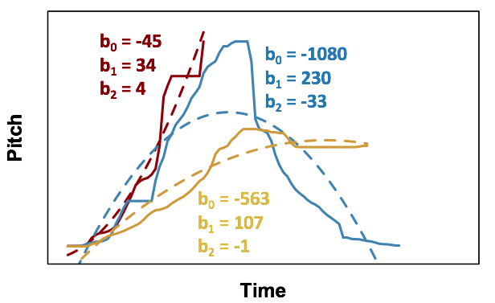
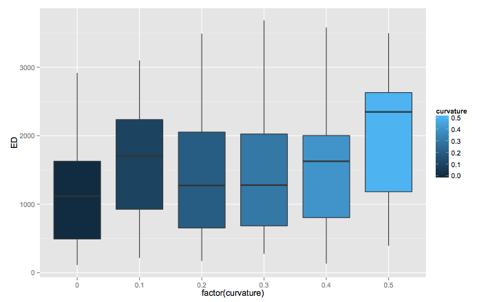

```{r, echo=F, eval=F}
setwd("/Library/WebServer/Documents/ILMTurk/stats/R")
```

# Introduction

In this analysis, we try to quantify how different signals are from each other.  Signals are approximated using a polynmial curve, and then the coefficients of the curve are compared (we also add signal length as an extra coefficient).  The hypothesis is that higher curvatures will lead to greater distinctiveness between signals.

The analysis below was done by Bodo:





\newpage

# Libraries
```{r}
library(gplots)
library(factoextra)
library(lme4)
```


# Load data
```{r}
signals_Nij = read.csv("../Data/Signals_Nij.csv",stringsAsFactors=F)
signals_MT = read.csv("../Data/Signals_MT.csv",stringsAsFactors=F)
signals_SONA = read.csv("../Data/Signals_SONA.csv",stringsAsFactors=F)

signals_MT$run = "MT"
signals_Nij$run = "Nij"
signals_SONA$run = "SONA"


dx = rbind(signals_MT,signals_SONA)
```

Convert the acoustic signal from Hz to Bark scale:

```{r}
getSignalX =function(x){
  as.numeric(strsplit(x,"_")[[1]])
}

toBark = function(f){
  (26.81 / (1+ (1960/f))) - 0.53
}

signalToBark = function(signal){
  signal = getSignalX(signal)
  signal = toBark(signal)
  return(paste(signal, collapse='_'))
}

dx$barkSignal = sapply(dx$hzSignal,signalToBark)
```


# Fit polynomial curves to the signals

Some helper functions.

```{r}
getCurveFit = function(sig1, degree=3){
  # convert signal to numbers
  sig1 = getSignalX(sig1)
  # fit a polynomial function
  # Note that we're compressing every signal into 
  # the same time range. This really helps the MDS
  fit <- lm(sig1~
    poly(seq(0,1,length.out = length(sig1)),
    degree,raw=TRUE))
  # get the coefficients
  coefs = coef(fit)
  names(coefs) = paste("c",1:length(coefs),sep='')
  coefs[is.na(coefs)] = 0
  # return the coefficients, 
  # plus length as an extra coefficient,
  # plus the adjusted R squared of the fit
  return(c(coefs,
           len=length(sig1),
           adj.r.squared=summary(fit)$adj.r.squared))
}

# Vectorised version of the above
getCurveFit.vec = function(signals,degree){
  res = t(sapply(signals, getCurveFit, degree=degree))
  rownames(res) = NULL
  res = as.data.frame(res)
  return(res)
}
```

What degree polynomial curves should we use?  For a range of degrees, fit the curves and look at the distribution of goodness of fit.  The code below prints a histogram and the r squared value which 95% of the signals achieve.

```{r, warning=F}
for(i in 1:5){
  res = getCurveFit.vec(dx$physSignal,i)
  hist(res$adj.r.squared,main=paste('degree',i), xlim=c(0,1),breaks=c(-Inf,seq(0,1,length.out = 20),Inf))
  print(quantile(res$adj.r.squared,na.rm=T,0.05))
}
```

Choose a final degree.

```{r}
chosen.degree = 4
res = getCurveFit.vec(dx$physSignal,chosen.degree)
```

Plot some examples of fits:

```{r}
nx = 4
par(mfrow=c(nx,nx), mar=c(0,0,0,0))
for(i in sample(1:nrow(dx),nx^2)){
  sig1 = dx[i,]$physSignal
  sig1 = getSignalX(sig1)
  fit <- lm(sig1~
              poly(seq(0,1,length.out = length(sig1)),
                   chosen.degree,raw=TRUE))
  plot(sig1, pch=16, xaxt='n',yaxt='n')
  lines(1:length(sig1),predict(fit),col=2, lwd=2)
}
```

Plot some examples of bad fits.  The top left graph below shows a weird fit that returns an R^2 of less than 0.

```{r}
sel = order(res$adj.r.squared)[1:(nx^2)]
par(mfrow=c(nx,nx), mar=c(0,0,0,0))
for(i in sel){
  sig1 = dx[i,]$physSignal
  sig1 = getSignalX(sig1)
  fit <- lm(sig1~poly(1:length(sig1),chosen.degree,raw=TRUE))
  plot(sig1, pch=16, xaxt='n',yaxt='n')
  lines(1:length(sig1),predict(fit),col=2, lwd=2)
}
```

## MDS

```{r}
res.scaled = apply(res[1:(ncol(res)-1)],2,scale)
dist = dist(res.scaled)
mds = cmdscale(dist,eig=T,k=2)
mds$GOF

par(mfrow=c(1,1),mar=c(5,4,4,2))
plot(mds$points[,1],mds$points[,2])
```

## Principal components analysis

```{r}
pca = prcomp(res.scaled)
plot(pca)
fviz_pca_var(pca)
fviz_pca_ind(pca, 
             label="none", 
             habillage=dx$curvature,
             addEllipses=TRUE, ellipse.level=0.9) 
```


## Final calculation

Fit the curves for all signals, both physical and acoustic (bark).  Scale the variables first, so there's no magnitude effects. (Note: I'm not entierly sure about the scaling - it breaks the links between the coefficients?)

```{r, warning=F}
res.phys = getCurveFit.vec(dx$physSignal,chosen.degree)
res.scaled.phys = apply(res.phys[1:(ncol(res.phys)-1)],2,scale)
colnames(res.scaled.phys) = paste("phys",colnames(res.scaled.phys),sep='')

# Use bark scale for acoustic!
res.hz = getCurveFit.vec(dx$barkSignal,chosen.degree)
res.scaled.hz = apply(res.hz[1:(ncol(res.hz)-1)],2,scale)
colnames(res.scaled.hz) = paste("hz",colnames(res.scaled.hz),sep='.')

# Make a new data frame with all the data
# in case we need to use later
dx2 = cbind(dx,res.scaled.phys,res.scaled.hz)
dx2$participant = paste(dx2$run,dx2$chain2,dx2$gen)
```

Now, for each participant we need to work out the distance between the signals they produced.  Create a new data frame *BW.distinctiveness*, with each row being a single participant.  Then cluster the rows by participant, and work out the Euclidean distance between the coefficients.  (I'm not sure about using the Euclidean distance??)

```{r}
# Yes, I should be using mapply.
part.distinctiveness.phys = tapply(
  1:nrow(dx), dx2$participant, function(i){
    m = res.scaled.phys[i,1:(ncol(res.scaled.phys)-1)]
    if(nrow(m)==1){
      return(NA)
    } else{
      # not entierly sure this is working?
      return(mean(dist(m)))
    }
  }
)

part.distinctiveness.hz = tapply(
  1:nrow(dx), dx2$participant, function(i){
    m = res.scaled.hz[i,1:(ncol(res.scaled.hz)-1)]
    if(nrow(m)==1){
      return(NA)
    } else{
      return(mean(dist(m)))
    }
  }
)

BW.distinctiveness = data.frame(
  part.distinctiveness.phys = part.distinctiveness.phys,
  part.distinctiveness.hz = part.distinctiveness.hz
)

for(v in c("curvature",'gen','chain2','run')){
  vx = tapply(dx2[,v], dx2$participant, head,n=1)
  BW.distinctiveness[,v] = vx
}
```

# Statistics

Remove outliers and scale data:

```{r}
# Remove some outliers
bx = BW.distinctiveness[
  BW.distinctiveness$part.distinctiveness.hz <6,]
# scale data
bx$part.distinctiveness.phys.scaled = scale(bx$part.distinctiveness.phys)
bx$part.distinctiveness.hz.scaled = scale(bx$part.distinctiveness.hz)
bx$curvature.norm = bx$curvature - 0.2
bx$gen.norm = bx$gen - 5
```

Plot some basic tables:

```{r warning=F}
plotmeans(part.distinctiveness.phys~curvature,
          BW.distinctiveness, main='Physical signal')
plotmeans(part.distinctiveness.hz~curvature,
          BW.distinctiveness, main='Acoustic signal')

plotmeans(part.distinctiveness.phys~gen,
          BW.distinctiveness, main='Physical signal')
plotmeans(part.distinctiveness.hz~gen,
          BW.distinctiveness, main='Acoustic signal')
```

\newpage

##  LMER analysis of physical signal

(Note: if the SONA runs are excluded, then the effect of generation becomes stronger).

```{r}
m0 = lmer(part.distinctiveness.phys.scaled~
            1 + (1 + gen.norm + curvature.norm||run) +
                (1 + gen.norm||chain2),
          bx)
m1 = update(m0, ~.+gen.norm)
m2 = update(m1, ~.+curvature.norm)
m3 = update(m2, ~.+curvature.norm:gen)
```

```{r}
x = anova(m0,m1,m2,m3)
x[1:nrow(x),1:ncol(x)]
```

##  LMER analysis of acoustic signal


```{r}
m0 = lmer(part.distinctiveness.hz.scaled~
            1 + (1 + gen.norm + curvature.norm||run) +
                (1 + gen.norm||chain2),
          bx)
m1 = update(m0, ~.+gen.norm)
m2 = update(m1, ~.+curvature.norm)
m3 = update(m2, ~.+curvature.norm:gen)
```

```{r}
x = anova(m0,m1,m2,m3)
x[1:nrow(x),1:ncol(x)]
```


